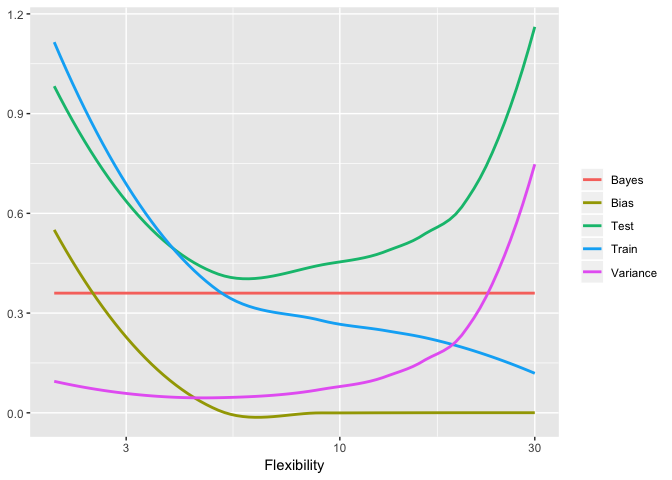
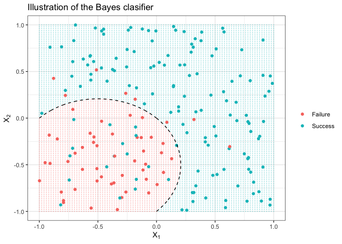

Selecting and fitting a model
================
Sanja Miklin
1/14/2019

Question 1
----------

For each part, indicate whether we would generally expect the performance of a flexible statistical learning method to be better or worse than an inflexible method. Justify your answer.

**a) The sample size *n* is extremely large, and the number of predictors *p* is small.**

With a large sample size and a small number of predictors, a flexible method will probably perform better—because of the flexibility, it will fit the data better, and we would expect it to be a fairly accurate model because of the large n and small p (over-fitting is unlikely to be a problem)

**b) The number of predictors *p* is extremely large, and the number of observations *n* is small.**

With a small n and a very large p, an inflexible method will probably be better, because over-fitting with a flexible method would be a big issue. An inflexible method such as lasso regression will also force a decrease in p, making the model more interpretable.

**c) The relationship between the predictors and response is highly non-linear.**

With a highly non-linear relationship, we would expect the flexible method as more flexible methods allow for modeling of non-linear and increasingly complex relationships.

**d) The variance of the error terms *σ*2 = Var(*ϵ*) is extremely high.**

In case of large variance of the error terms, we would expect an inflexible method to perform better, as a flexible method would capture too much noise in the model.

Question 2: Bias-variance decomposition
---------------------------------------

1.  Generate a graph of typical (squared) bias, variance, training error, test error, and Bayes (irreducible) error curves, on a single plot, as we go from less flexible statistical learning methods towards more flexible approaches. The x-axis should represent the amount of flexibility in the method, and the y-axis should represent the values for each curve. There should be five curves. Make sure to label each one.

1.  Explain why each of the five curves has the shape displayed in part (a).

**Bayes (irreducible) error** is a constant because it has to do with the data (specifically *ϵ*), not with the models that we are choosing—changing the modeling strategy does not impact the irreducible error. We see **squared bias** decreasing as the flexibility increases because more flexible methods will fit the model to the sample better. In contrast, **variance** increases with flexibility—the more flexible the model,the better it will fit a certain sample but because of over-fitting, the flexible models will vary more with each different sample. This trade-off is also seen with the training and testing MSE: the more flexible the model, the more it can minimize the **train MSE**. To a certain point, more flexible models will also decrease the **test MSE** because they are better models, but if too flexible, they over-fit the sample data which will result in a larger test MSE (therefore the U-shape) Test MSE also equals to the sum of the irreducible error, squared bias and variance, and it is clear from the plot how this results in the shape of the test ME line.

Question 3
----------

For classification problems, the test error rate is minimized by a simple classifier that assigns each observation to the most likely class given its predictor values:

Pr(*Y* = *j*|*X* = *x*0)

where *x*0 is the test observation and each possible class is represented by *J*. This is a **conditional probability** that *Y* = *j*, given the observed predictor vector *x*0. This classifier is known as the **Bayes classifier**. If the response variable is binary (i.e. two classes), the Bayes classifier corresponds to predicting class one if Pr(*Y* = *j*|*X* = *x*0)&gt;0.5, and class two otherwise.

Figure 2.13 in \[ISL\] illustrates a simulated example defining the decision boundary for a hypothetical data set. Produce a graph illustrating this concept. Specifically, implement the following elements in your program:

1.  Set your random number generator seed.
2.  Simulate a dataset of *N* = 200 with *X*1, *X*2 where *X*1, *X*2 are random uniform variables between \[ − 1, 1\].
3.  Calculate *Y* = *X*1 + *X*12 + *X*2 + *X*22 + *ϵ*, where *ϵ* ∼ *N*(*μ* = 0, *σ*2 = 0.25).
4.  *Y* is defined in terms of the log-odds of success on the domain \[ − ∞, +∞\]. Calculate the probability of success bounded between \[0, 1\].
5.  Plot each of the data points on a graph and use color to indicate if the observation was a success or a failure.
6.  Overlay the plot with Bayes decision boundary, calculated using *X*1, *X*2
7.  Give your plot a meaningful title and axis labels.
8.  The colored background grid is optional.

